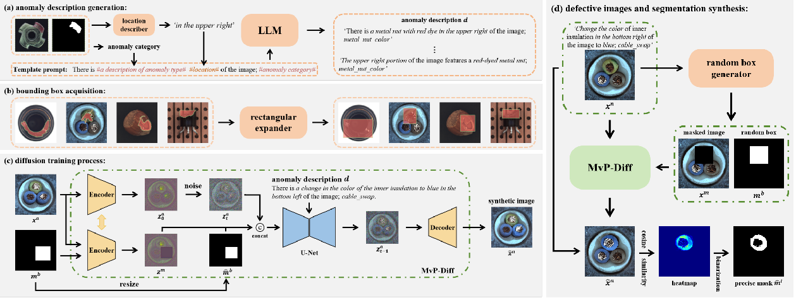

#  Multivariate yet Precise Diffusion Model (MvP-Diff)


This repository is the official implementation of the following paper:

**Multivariate yet Precise Anomaly Images and Segmentation Synthesis**<br>

> **Abstract**<br>
> <font size=3> *This paper delves into the simultaneous synthesis of anomaly image samples and their corresponding segmentation labels, addressing the challenge of limited anomaly data. Previous generative approaches relied heavily on the precise yet sparse masks, available from the given dataset, to guide the synthesis of anomaly images. This reliance restricted the variety of the guidance masks, leading to a lack of diversity in the synthesized defective areas. Furthermore, the simplistic strategy of directly employing guidance masks as labels for synthesized images has frequently led to the mask drift issue. To overcome these constraints, we introduce the Multivariate yet Precise Diffusion model (MvP-Diff). This model initiates the synthesis process by producing a diverse array of random bounding boxes. Within these boxes, MvP-Diff further creates multivariate defective regions with varying sizes, shapes, and patterns based on defect-free images. By comparing the differences between the anomaly and normal images, we can obtain more precise mask labels for the defective regions, effectively mitigating the mask drift phenomenon. Extensive experiments demonstrate that MvP-Diff outperforms existing methods in producing realistic and diverse anomaly samples. Moreover, following the training of existing anomaly detection and segmentation methods with our synthesized samples, an approximate 10\% enhancement in IoU can be observed.* </font>


## Dataset

Download the [MVTec Anomaly Detection (MVTec AD)](https://www.mvtec.com/company/research/datasets/mvtec-ad/) dataset and unzip the archive files under ```./dataset```. (If you wish to try your own datasets, organize the defect-free images, defect images and the corresponding masks in a similar way.)

    
## Stage 1: Task Specific Dataset Construction

- Obtain defective location based on anomaly images and corresponding masks: (*The relevant language descriptions and corresponding image information will be stored as .jsonl files.*)
    ```shell
    python location_describer.py --classname bottle --dataset ./dataset --outdir ./script
    ```
- Transfer masks in dataset to bounding box:
    ```shell
    python boundbox.py --classname bottle --dataset ./dataset  

## Stage 2: Diffusion Training Process
- Before training the model, please download the [diffusion v1-5 inpainting checkpoint](https://huggingface.co/runwayml/stable-diffusion-v1-5) and place the files under ```./checkpoints```. 
- Train the MvP-Diff model to generate anomaly images with text description and bounding box:
    ```shell
    python train_diffusion.py --pretrained_model_name_or_path checkpoints/inpainting --train_data_dir ./dataset/bottle \
     --train_batch_size 6   --gradient_accumulation_steps 4  --num_train_epochs 1000 --checkpointing_steps 500 \
     --learning_rate 1e-07  --lr_scheduler constant  --seed 0 --validation_epochs 100 --validation_file ./script/bottle/bottle_test.jsonl  \
     --output_dir ./output  --prediction_type epsilon  --scale_lr --snr_gamma 10 \
    
    # You may also try different values for the following settings
    # --lr_scheduler: the scheduler type to use
    # --resume_from_checkpoint: (flag) whether training should be resumed from a previous checkpoint
    ```
- Or you can use accelerator to speed up model training:
    ```shell
    sh train_diffusion.sh
    ```

## Stage 3: Anomaly Image Synthesis
- Generate 100 random bounding box and its language descriptions:
  ```shell
  python random_box.py --classname bottle --dataset ./dataset --outdir ./output/dataset/mask --num 100
  ```
  
- Generate 100 anomaly images with previous saved bounding box: 
    ```shell
    python inpainting.py --classname bottle --dataset ./dataset  --output ./output/dataset/image --num 100 \
    --num_inference_steps 20 --guidance_scale 3.5 --extract_mask
        
    # You may also try different values for the following settings
    # --seeds: specify the random seeds to be used
    # --guidance_scale: the closeness of the generated image to the language descriptions, a value greater than 1
    # --num_inference_steps: the number of denoising steps
    # --strength: indicates extent to transform the reference image
    # --extract_mask: (flag) whether to extract precise mask of the defective region 
    ```

     
